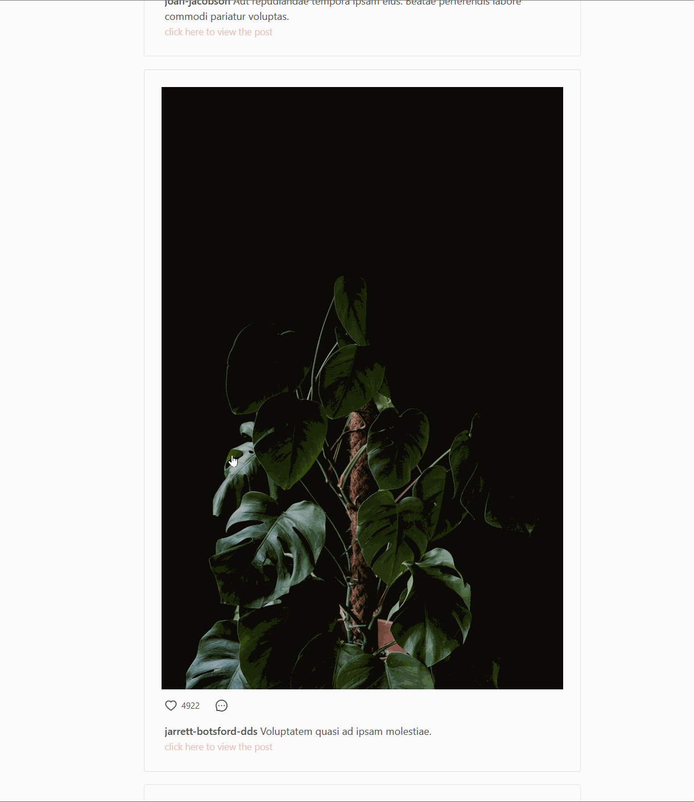

## Instagratification - SOEN 341

This project is about creating an Instagram like website. There will be three core features as follows: Post a picture, Follow a user and Leave comments to a posted picture. Additionally, one extra core feature will be implemented which will be decided by our team and approved by our client which is our teaching assistant.

## Team Members
- Wei Chen Huang (Wilson) | willyyhuang
- Massimo Triassi | m-triassi
- Ramsha Khalid | Ramshaaa
- Marieme Kourouss | mariemek
- Robert Nittolo | RobertoNittolo
- Aymen Metallaoui | AymenMetallaoui

## Learning Laravel

Laravel has the most extensive and thorough [documentation](https://laravel.com/docs) and video tutorial library of all modern web application frameworks, making it a breeze to get started with the framework.

If you don't feel like reading, [Laracasts](https://laracasts.com) can help. Laracasts contains over 1500 video tutorials on a range of topics including Laravel, modern PHP, unit testing, and JavaScript. Boost your skills by digging into our comprehensive video library.

## Languages and tools that will be used:
- PHP
- HTML
- CSS
- JavaScript
- Framework: Laravel, React

## License

Instagrafitication is open-sourced software licensed under the [MIT license](https://opensource.org/licenses/MIT).

## Demo

The following is a number of gifs and images demoing the functionality of this project. Please excuse any artifacts in the gifs that is caused by the capture software used.

You may also notice that many users have the same image posted on their profile, this is a symptom of how quickly we generated our users and their posts. The Unsplash API was unable to supply a new link to an image fast enough, likely caused by caching the response from an API call.

#### Login and like

#### Logout and Register a new Account

#### Upload an image

#### Follow another User

#### Comment on a Photo

#### Search for a User

